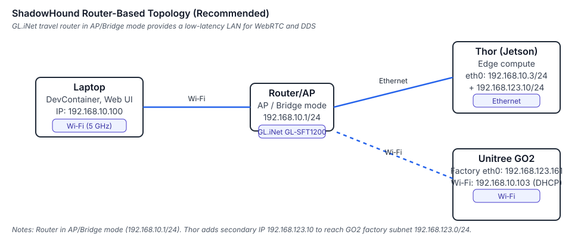

# ShadowHound Network & Power Topologies (Thor + GO2 Pro + Sensors)

## Purpose
Preserve historical context while signaling that this page requires verification against the current workflow.

## Prerequisites
- Review the legacy notes below to understand original assumptions and instructions.
- Cross-check commands and links with the latest tooling before execution.

## Steps
1. Read through the legacy notes captured under **Legacy Notes** and flag outdated guidance.
2. Update or replace the content with validated procedures as time permits.
3. Record verification outcomes in the validation checklist and mark follow-up tasks in the backlog.

### Legacy Notes
This doc provides **three wiring/network configurations** you can deploy as you iterate:
1) **Baseline:** GO2 Pro + AGX Thor (no external sensors)
2) **RealSense D555 Variant:** Adds D555 over Ethernet/PoE
3) **DreamVu Variant:** Adds PAL USB/Mini over USB to Thor

All designs assume the **GL.iNet GL‑SFT1200 (Opal)** in AP/Bridge mode acting as a 3‑port wired switch, and a **140 W dual‑USB‑C power bank**.

---

## Common Assumptions
- **Router mode:** Access Point / Bridge (WAN+LAN bridged). DHCP **off**; all devices use **static IPs**.
- **Time sync:** `chrony` or PTP (`ptpd`/`linuxptp`) with Thor as time master.
- **Cabling:** Cat6 or better. Keep cable runs <5 m if possible.
- **Router address:** `192.168.10.1`

---

## 1) Baseline: Thor ⇄ GO2 Pro via Travel Router

### Diagram


*Baseline topology: GL‑SFT1200 in AP/Bridge mode, Thor on Ethernet, GO2 on Wi‑Fi (and factory Ethernet).* 

### Static IP Plan
| Device | Interface | IP |
|---|---|---|
| Router (GL‑SFT1200) | br‑lan | **192.168.10.1** |
| AGX Thor | eth0 | **192.168.10.3** |
| GO2 (onboard port) | eth0 | **192.168.123.161** *(factory net)* |

> **Note:** GO2's default subnet is `192.168.123.0/24`. Either (A) add a **secondary IP** on Thor's `eth0` (e.g., `192.168.123.10/24`) to talk to the GO2 directly **while keeping** `192.168.10.3/24` for the internal LAN, or (B) readdress GO2 into `192.168.10.0/24`. Option A is safer.

### Thor NIC Setup (Option A: dual-IP on same NIC)
```bash
# Primary LAN (to router)
sudo ip addr add 192.168.10.3/24 dev eth0
# Secondary IP for GO2 factory subnet
sudo ip addr add 192.168.123.10/24 dev eth0
```

### Router Setup
- Set **Access Point/Bridge** mode.
- Set router IP to **192.168.10.1**.
- Disable DHCP (or limit scope to your laptop only during bring‑up).

### Sync & Verification
```bash
# On Thor
ping -c 3 192.168.123.161   # GO2
ping -c 3 192.168.10.1      # Router

# Time sync (Thor as master)
sudo systemctl enable --now chrony
```

---

## 2) Variant: + RealSense D555 (Ethernet/PoE)

### Diagram
```
                  +------------------ wired LAN ------------------+
[140W PD Bank]    |                                                    |
   |       USB‑A 5V→ [GL‑SFT1200] —— (LAN1) —— [AGX Thor] —— USB‑C → (PD→PoE+) → [D555]
   |                                                     |
   |                                                     +—— (LAN2) —— [Unitree GO2]
   +— USB‑C PD (20V) → [AGX Thor]
```

### Power
- **Thor:** USB‑C PD from the 140 W bank.
- **Router:** USB‑A 5 V from the bank.
- **D555:** **USB‑C PD → PoE+ injector** (802.3at) → RJ‑45 to D555.

### Static IP Plan
| Device | Interface | IP |
|---|---|---|
| Router | br‑lan | **192.168.10.1** |
| Thor | eth0 | **192.168.10.3** and **192.168.123.10** (secondary) |
| GO2 | eth0 | **192.168.123.161** |
| D555 | eth0 | **192.168.10.4** |

> D555 on `192.168.10.0/24` keeps all non‑GO2 devices on a single LAN. Thor's secondary IP reaches the GO2 on its factory subnet.

### Router Setup
- AP/Bridge mode, IP **192.168.10.1**.
- No DHCP.

### Thor Net Setup
```bash
sudo ip addr add 192.168.10.3/24 dev eth0
sudo ip addr add 192.168.123.10/24 dev eth0
```

### PTP/Chrony
- Run `linuxptp` (ptp4l + phc2sys) **or** `chrony` on Thor; slaves on GO2 (if supported) and any Linux SBCs.

### Sanity Tests
```bash
ping -c 3 192.168.10.4    # D555
ping -c 3 192.168.123.161 # GO2
iperf3 -c 192.168.10.4 -t 10
```

### ROS 2 / Holoscan Notes
- D555 over Ethernet: ingest via librealsense/ROS2 (`realsense2_camera`) or Holoscan operator if available.
- Ensure jumbo frames **off** unless end‑to‑end supported (router may not pass 9k MTU).

---

## 3) Variant: + DreamVu PAL (USB or Mini)

### Diagram
```
                 +------------------ wired LAN ------------------+
[140W PD Bank]   |                                                   |
   |      USB‑A 5V→ [GL‑SFT1200] —— (LAN1) —— [AGX Thor] (USB3) —— [DreamVu PAL USB/Mini]
   |                                                   |
   |                                                   +—— (LAN2) —— [Unitree GO2]
   +— USB‑C PD (20V) → [AGX Thor]
```

### Power
- **Thor:** USB‑C PD from the 140 W bank.
- **Router:** USB‑A 5 V from the bank.
- **DreamVu PAL:** Powered via **USB 5 V** from Thor.

### Static IP Plan
| Device | Interface | IP |
|---|---|---|
| Router | br‑lan | **192.168.10.1** |
| Thor | eth0 | **192.168.10.3** and **192.168.123.10** (secondary) |
| GO2 | eth0 | **192.168.123.161** |
| PAL USB/Mini | USB | *N/A (USB, no IP)* |

### Thor Net Setup
```bash
sudo ip addr add 192.168.10.3/24 dev eth0
sudo ip addr add 192.168.123.10/24 dev eth0
```

### SDK / ROS 2 Bring‑up (PAL USB/Mini)
```bash
# After installing DreamVu PAL SDK (CUDA/TensorRT build recommended):
ros2 launch pal_camera_ros2 pal_mini.launch.py   # or pal_usb.launch.py
```

### Holoscan Notes
- PAL USB/Mini perform **host‑side GPU processing** via the SDK (stereo + dewarp). Budget ~15–30% GPU at full pano.
- Use ROI gating: downsample pano, detect motion/agents, crop tiles → send to VLM.

---

## Optional: Re-address the GO2 to the LAN
If you prefer a single subnet for everything, change GO2 to `192.168.10.2/24`. Update Thor to **only** `192.168.10.3/24` and remove the secondary IP. This simplifies routing but diverges from factory defaults.

---

## Quick Checklists

### Router (GL‑SFT1200)
- [ ] Access Point / Bridge mode
- [ ] IP `192.168.10.1`
- [ ] DHCP off
- [ ] WAN port bridged to LAN

### Thor
- [ ] `eth0` → `192.168.10.3/24`
- [ ] Add `192.168.123.10/24` alias (if GO2 remains factory subnet)
- [ ] `chrony` or `ptp4l` enabled

### D555 Variant
- [ ] PD→PoE+ injector inline, Cat6 to D555
- [ ] D555 static IP `192.168.10.4`
- [ ] Verify `ping`, `rs-enumerate-devices`, ROS 2 topics

### DreamVu Variant
- [ ] USB3 cable direct to Thor (or powered hub)
- [ ] PAL SDK (CUDA build) installed
- [ ] ROS 2 node publishes `/pal/image_raw`, `/pal/depth`, `/pal/point_cloud`

---

## Verification Commands
```bash
# Connectivity
ping -c 3 192.168.10.1    # Router
ping -c 3 192.168.10.4    # (D555 variant)
ping -c 3 192.168.123.161 # GO2

# Throughput (install iperf3)
iperf3 -s  # on Thor
iperf3 -c 192.168.10.3 -t 15  # from another host

# ROS 2 topic sanity (D555 example)
ros2 topic list | grep realsense

# ROS 2 topic sanity (PAL example)
ros2 topic list | grep /pal/
```

---

*End of doc — v1.0*


## Validation
- [ ] Legacy guidance reviewed for accuracy and converted to the new workflow where applicable.
- [ ] Links updated to use vault-friendly wikilinks or confirmed for external references.
- [ ] Outstanding migration work captured as tasks in the backlog.

## References
- [[hardware/README|Hardware Stack Overview]]
- [[index|Knowledge Base Index]]
