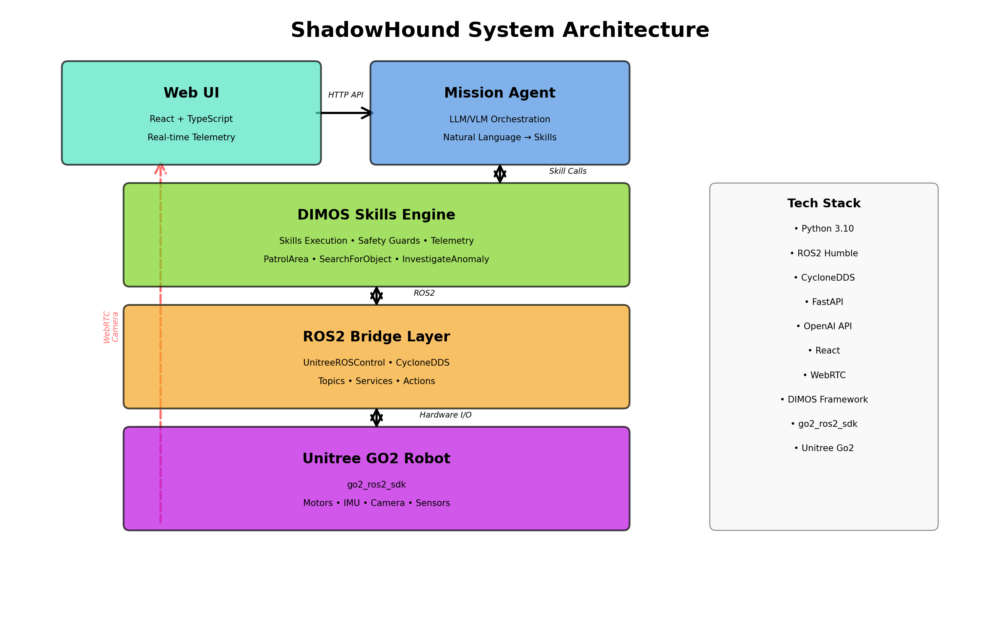
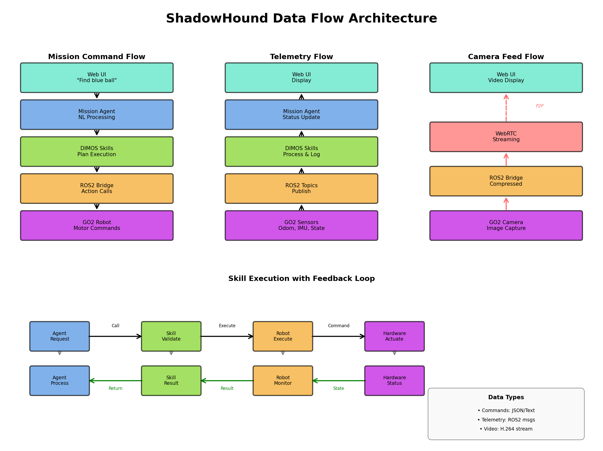
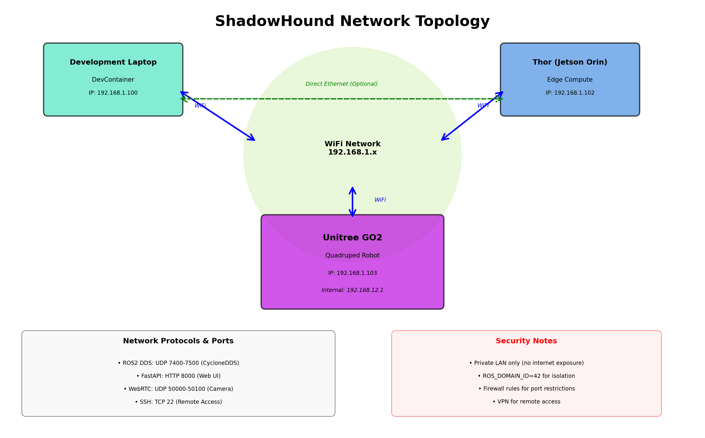
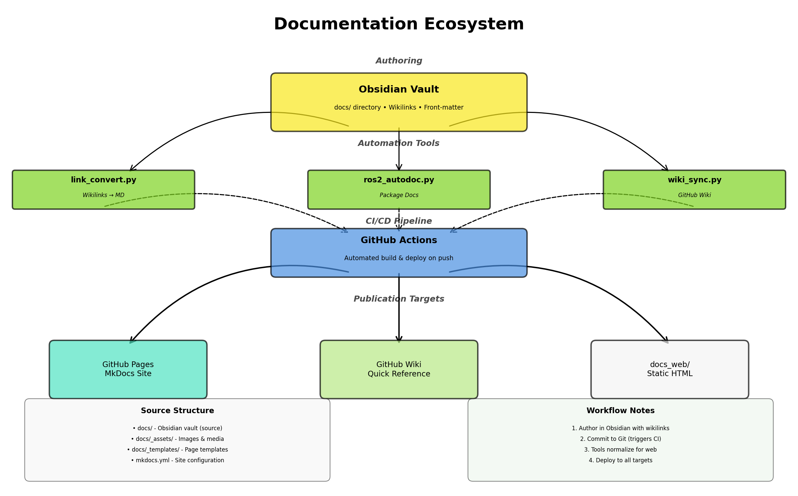

# ShadowHound Knowledge Base

## Purpose
Provide a curated entry point into the Obsidian vault and downstream public documentation surfaces.

## Architecture Overview

ShadowHound is an autonomous mobile robot system combining ROS2 navigation with LLM/VLM-driven planning. The system architecture is built on four main layers:

*Figure 1: System Architecture - The layered design from Web UI through Mission Agent, DIMOS Skills Engine, ROS2 Bridge, to the Unitree GO2 hardware.*

### Key Data Flows

*Figure 2: Data Flow - Mission commands flow top-down, telemetry flows bottom-up, camera feeds use WebRTC, and skills execute with feedback loops.*

### Network Topology

*Figure 3: Network Topology - Development laptop, Thor (Jetson Orin), and GO2 robot connected via WiFi network with optional direct Ethernet.*

### Documentation Workflow

*Figure 4: Documentation Ecosystem - Obsidian vault authoring through automation tools and CI/CD to multiple publication targets.*

## Prerequisites
- Clone the repository and open the `/docs` directory as an Obsidian vault.
- Install the Obsidian Markdown Links core plugin (enabled by default).

## Steps
1. Review the directory hubs below to explore specific topic areas.
2. Use the reusable template at [`_templates/page`](./_templates/page.md) when authoring new content.
3. Store shared media inside [`_assets/`](./_assets/) and reference them with relative paths.

## Documentation Directories

### 📋 Planning & Status
**[[project_overview/project_overview_hub|Project Overview]]**
- Strategic planning, roadmaps, and status tracking
- Quick start guides and operational references
- 8 active documents: roadmap, todo, setup status, architecture review

### 🏗️ System Design
**[[architecture/architecture_hub|Architecture]]**
- System architecture and design decisions
- Component interactions and data flows
- Layered design: Application → Agent → Skills → Robot

### 🔧 Development
**[[development/development_hub|Development]]**
- Contributor guides and development policies
- Git workflows and submodule management
- 11 documents including cleanup tracking and checklists

### 💻 Software
**[[software/software_hub|Software]]**
- ROS2 packages and implementations
- LLM integration (vLLM, Ollama) - 26+ docs
- Web interface and WebRTC communication
- Configuration and environment setup

### 🤖 Hardware
**[[hardware/hardware_hub|Hardware]]**
- Unitree Go2 platform and sensor suite
- Network and power topologies
- Hardware specifications and integration guides

### 🌐 Networking
**[[networking/networking_hub|Networking]]**
- ROS2 DDS and WebRTC configuration
- Direct connectivity testing
- Multi-machine deployment topologies

### 🐛 Troubleshooting
**[[troubleshooting/troubleshooting_hub|Troubleshooting]]**
- Diagnostic workflows and health checks
- Known issues and resolutions
- Startup validation and robot testing

### 🔬 Research & Testing
**[[simulation/simulation_hub|Simulation]]** - Gazebo and hardware-in-the-loop
**[[research/research_hub|Research]]** - Experiments and development logs

### 📦 Supporting
**[[integrations/integrations_hub|Integrations]]** - DIMOS, vision, AI integrations
**[[issues/issues_hub|Known Issues]]** - Bug tracking and workarounds
**[[history/]]** - Archived legacy documentation

## Validation
- [ ] Vault opens in Obsidian without warnings.
- [ ] All category links resolve inside Obsidian.
- [ ] Link conversion step renders correctly on GitHub Pages and Wiki.

## References
- [Authoring Guidelines](../AGENTS.md)
- [Repository README](../README.md)
